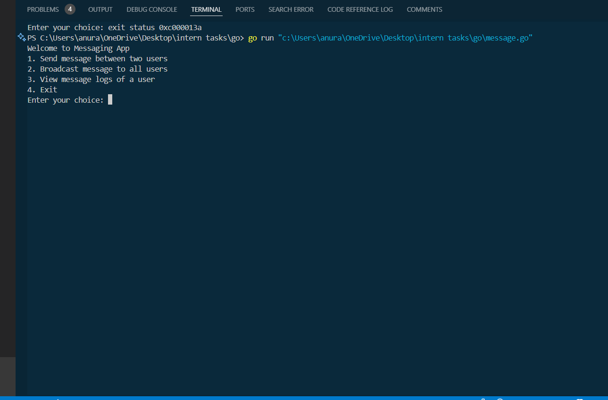
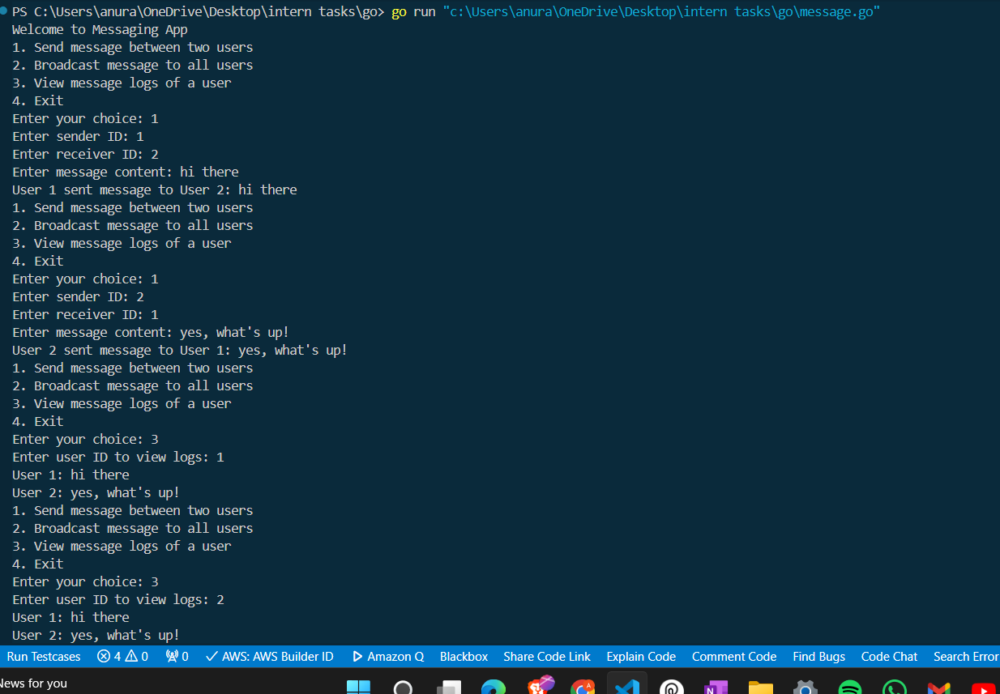
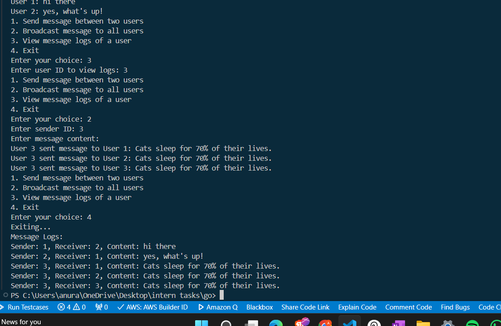

# Go Messaging App

Welcome to the Go Messaging App! This is a command-line application written in Go that facilitates communication among multiple users via a central channel.

## Prerequisites

Before running this application, make sure you have Go installed on your system. You can download and install it from the [official Go website](https://golang.org/).

## Installation

1. Clone this repository to your local machine:

```bash
git clone https://github.com/your-username/go-messaging-app.git
```

2. Navigate to the project directory:

```bash
cd GO-Messaging-App
```

3. Run the application:

```bash
go run message.go
```

## Features

- **Send Message Between Two Users:** Users can send messages to each other by specifying the sender ID, receiver ID, and message content.

- **Broadcast Message to All Users:** Users can broadcast a message to all other users by specifying the sender ID and message content.

- **View Message Logs of a User:** Users can view their message logs by providing their user ID.

- **Random Fact Generation:** If a user sends an empty message, a random fact will be fetched from an external API and used as the message content.

## Usage

1. Upon running the application, you will be presented with a menu to choose from various options.

2. Select the desired option by entering the corresponding number and follow the prompts.

3. Enjoy seamless communication with other users!






## Contributing

Contributions are welcome! If you have any suggestions, improvements, or feature requests, feel free to open an issue or create a pull request.
